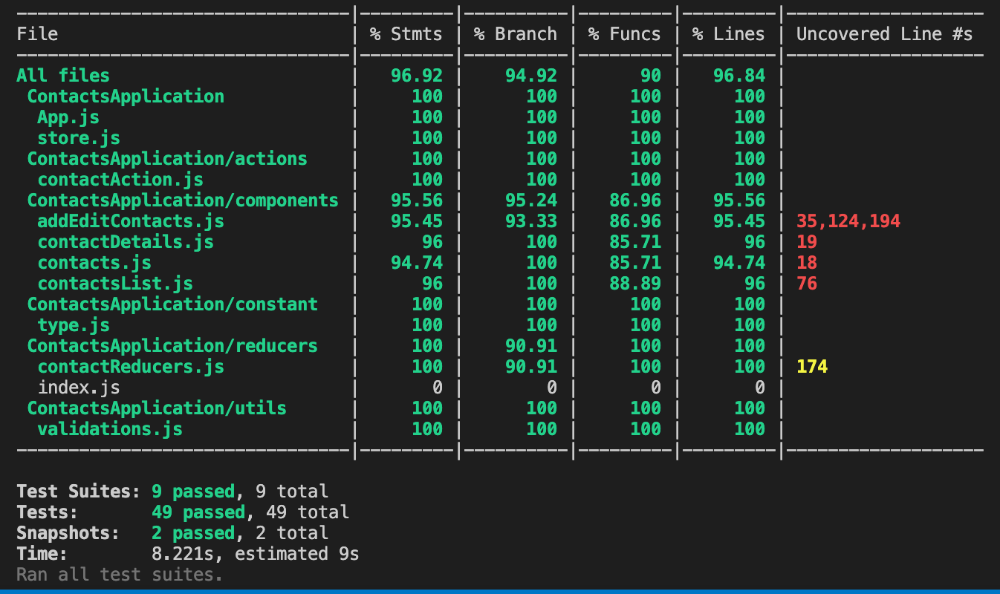

# Contacts Application using React Native
## Using Redux
 Android Contacts Application User Interface demo   
  
  
## iOS & Android application User Interface  
 

## Testing  
Test Coverage screenshot.

